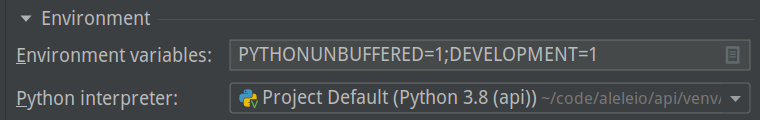

# Contributing to alele.io | API Component

## Setting Up the Local Development Environment

**Python Version** \
We are using [pyenv](https://github.com/pyenv/pyenv) for Python version management.
Either check if you want to do the same or install the version specified in [.python-version](.python-version)
for your operating system: [guide to installation](https://realpython.com/installing-python/).

**Virtual Environment** \
To separate the local python packages from the system python's packages, you want to set up a virtual environment
for the project. Create it with python's `venv` module in the project root, activate it and `pip` install
the requirements:
    
    [kita@bonga]$ cd ~/code/aleleio-api
    [kita@bonga]$ cat .python-version
    [kita@bonga]$ python -m venv venv
    [kita@bonga]$ source venv/bin/activate
    (venv)[kita@bonga]$ pip install -r requirements.txt
    (venv)[kita@bonga]$ 
    
Deactivate the virtual environment at any time with `deactivate`.

**Web Server**
FastAPI uses [uvicorn](https://www.uvicorn.org/) as an ASGI server. In the virtual environment, you can run it
from your terminal:

    (venv)[kita@bonga]$ uvicorn asgi:api
    (venv)[kita@bonga]$ INFO: Started server process [2387]
    (venv)[kita@bonga]$ INFO: Uvicorn running on http://127.0.0.1:8000 (Press CTRL+C to quit)
    (venv)[kita@bonga]$

If you are using an IDE like [PyCharm](https://www.jetbrains.com/pycharm/) make sure to set a `DEVELOPMENT`
environment variable in your run configuration before running `asgi.py`.

## Workflow

*Todo: Document the workflow*

We are using [github flow](https://guides.github.com/introduction/flow/).

The changelog and future roadmap can be found in [ROADMAP.md](ROADMAP.md).